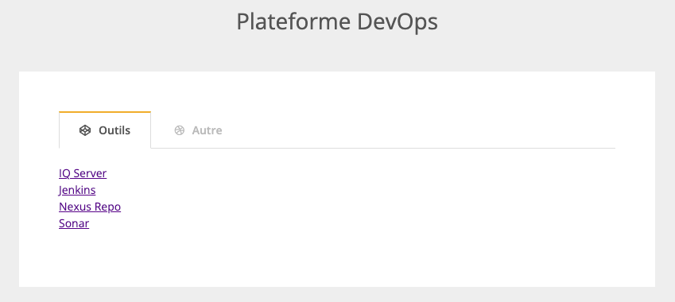
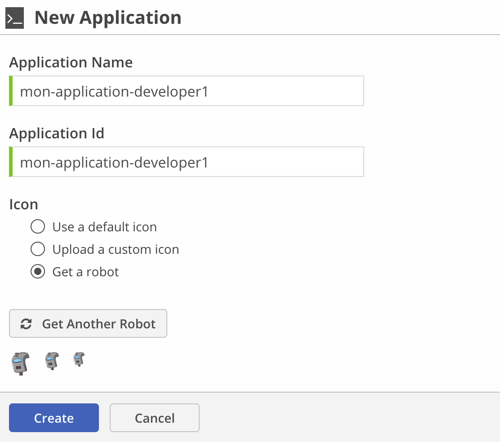

# Guide du développeur de la plateforme DevSecOps
----------

La plateforme DevSecOps est accéssible à l'adresse suivante

http://moneclipse.com/



## Clone des projets du lab

Cloner les projest de test depuis l'adresse suivante

```
git clone https://github.com/kamel2k/devsecops-lab.git
```

## Paramétrage Sonar

### Installation

Télécharger et Installer sonar-scanner selon le système d'exploitation de votre machine

https://docs.sonarqube.org/latest/analysis/scan/sonarscanner/

Voici la commande pour MacOS

```
brew install sonar-scanner
```

**Intégration avec IDE**

Pour ceux qui utilisent IntelliJ, voici les étapes pour installer le plugin

```
Intellij -> preferences > plugins > SonarLint > restart ide
```

SonarLint propose une instance locale de Sonar sur votre machine. Il est tout a fait possible de paramétrer le plugin intellij avec le serveur distant de SonarQube.

### Génération token d'API pour le compte de service

Suive ces étapes pour générer un token

```
Profil > My Account > Security > Generate Token > Saisir le nom du token : exemple my-token > Generate > Copier
```

Voici un exemple de Token

**a65f9a466e32d17855da4b40a4b1dbb2ff28b355**

### Paramétrage au niveau projet

#### Projet Backend Java

Ajouter un fichier **sonar-project.properties** à la racine du projet avec le contenu suivant :

```
sonar.projectKey=gainde-backend:developer1
sonar.host.url=http://sonar.moneclipse.com/
sonar.java.binaries=./target
sonar.sourceEncoding=UTF-8
```

Remplacer **developer1** par votre nom d'utilisateur.


#### Projet Frontend Angular

Créer le fichier **sonar-project.properties** à la racine du projet Frontend avec le contenu suivant

```
sonar.projectKey=angular-app:developer1
sonar.host.url=http://sonar.moneclipse.com/
sonar.sourceEncoding=UTF-8
sonar.sources=src
sonar.exclusions=**/node_modules/**
sonar.tests=src
sonar.test.inclusions=**/*.spec.ts
sonar.typescript.lcov.reportPaths=coverage/lcov.info
```

Remplacer **developer1** par votre nom d'utilisateur.


### Instrumentation avec sonar-scanner

#### Avec ligne de commande

Taper la commande sonar-scanner au niveau racide du projet **Backend** et du projet **Frontend**

```
sonar-scanner -Dsonar.login=a65f9a466e32d17855da4b40a4b1dbb2ff28b355
```

A noter que **-Dsonar.login** représente le token généré dans l'étape précedante

#### Avec docker

Si vous avez docker sur votre machine, voici la commande pour scanner un projet en local. Le rapport va être envoyé sur le serveur SonarQube

```
docker run \
    --rm \
    -e SONAR_HOST_URL="http://sonar.moneclipse.com/" \
    -e SONAR_LOGIN="a65f9a466e32d17855da4b40a4b1dbb2ff28b355" \
    -v "${PWD}:/usr/src" \
    sonarsource/sonar-scanner-cli
```

#### Avec IntelliJ

L'analyse du projet se fait en local

```
selectionner le projet > click droit > SonarLint > Analyze with SonarLint
```


## Paramétrage Nexus Repository

### Configuration du projet maven

Créer un fichier settings.xml dans le dossier ~/.m2 et voici le contenu

```xml
<settings>
  <servers>
  <server>
    <id>nexus</id>
    <username>developer1</username>
    <password>mot_passe</password>
  </server>
</servers>
  <mirrors>
    <mirror>
      <!--This sends everything else to /public -->
      <id>nexus</id>
      <mirrorOf>*</mirrorOf>
      <url>http://nexus.moneclipse.com/repository/maven-public/</url>
    </mirror>
  </mirrors>
  <profiles>
    <profile>
      <id>nexus</id>
      <!--Enable snapshots for the built in central repo to direct -->
      <!--all requests to nexus via the mirror -->
      <repositories>
        <repository>
          <id>central</id>
          <url>http://central</url>
          <releases><enabled>true</enabled></releases>
          <snapshots><enabled>true</enabled></snapshots>
        </repository>
      </repositories>
     <pluginRepositories>
        <pluginRepository>
          <id>central</id>
          <url>http://central</url>
          <releases><enabled>true</enabled></releases>
          <snapshots><enabled>true</enabled></snapshots>
        </pluginRepository>
      </pluginRepositories>
    </profile>
  </profiles>
  <activeProfiles>
    <!--make the profile active all the time -->
    <activeProfile>nexus</activeProfile>
  </activeProfiles>
</settings>
```

Remplacer **developer1** au niveau de **username** et **password** par vos paramètres d'accès.

Rebuilder le projet maven et analyser les logs de sortir pour voir le repository de téléchargement de dépendances.

### Configuration du projet angular

Pour npm, on configure le repository par projet (Contrairement à maven qui propose une configuration globale pour tous les projets)

Commencer par créer le fichier .npmrc à la racine du projet Angular avec le contenu

```
registry=http://nexus.moneclipse.com/repository/npm-all/
_auth=ZGV2ZWxvcGVyMTpkZXZlbG9wZXIx
```

**_auth=ZGV2ZWxvcGVyMTpkZXZlbG9wZXIx** est le hashage en base64 des identifiants (developer1/mot_passe).

Metter à jour **_auth** avec votre propre hash en le calculant grace a cette methode

```
echo -n 'developer1:mot_passe' | openssl base64
```

Créer le fichier .npmrc dans le dossier home de l'utilisateur avec votre adresse email JC
```
email=developer1@gmail.com
```

### Configuration d'IntelliJ

Preferences > Build, Execution, Deployment > Build Tools > Maven

s'assurer que le **"User settings file"** pointe vers le fichier **settings.xml**


### Configuration de Visual Code

Aucune configuration nécessaire

## Paramétrage Nexus IQ

### Installation de Nexus IQ Cli

Telecharger et installer nexus-iq-cli selon le systeme d'exploitation de votre machine

https://help.sonatype.com/iqserver/product-information/download-and-compatibility#DownloadandCompatibility-CLI

Voici les commandes pour MacOS

```
brew tap sonatype/nexus-iq-cli
brew install --cask nexus-iq-cli
```

### Creation d'une application dans Nexus IQ

Se connecter à Nexus IQ avec vos identifiants et au niveau de l'organisation DSID, appuyer sur **Add new App**

Saisir le nom du application et ajouter **-username** au niveau du nom de l'application et de l'id de l'application. **username** etant votre login



### Scan en ligne de commande

Localiser votre ID d'application : Cliquer sur **App ID to clipboard**


Taper la commande suivante

```
nexus-iq-cli -i mon-application-developer1 -a developer1:mot_passe -s http://nexusiq.moneclipse.com/ -t build .
```

Pour ceux qui utilisent **nexus-iq-cli**, la commande est la suivante
```
java -jar nexus-iq-cli.jar les_memes_paramètres
```

Utiliser l'url généré pour voir le résultat du rapport

**Exercice** : Lancer un scan sur le projet **frontend**. Ne pas oublier de créer une nouvelle application dans Nexus IQ

### Configuration d'IntelliJ

Installer le plugin **Sonatype Nexus IQ** au niveau d'IntelliJ

```
Intellij -> preferences > plugins > Sonatype Nexus IQ > restart ide
```

Après redemarrage

```
IntelliJ -> Preferences -> Nexus IQ
```

Saisir les informations relatives au serveur Nexus IQ


### Configuration de Visual Code

A vous de jouer
